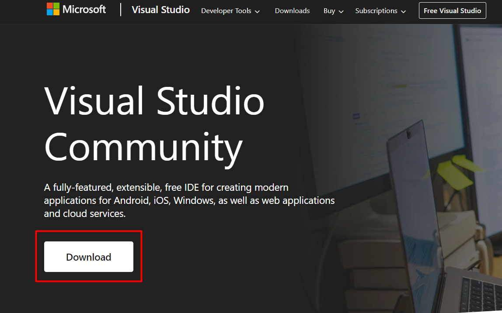
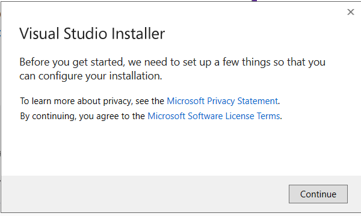
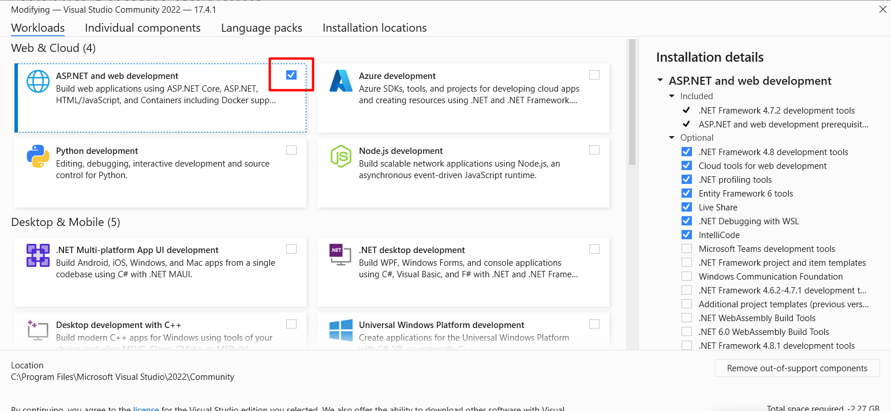
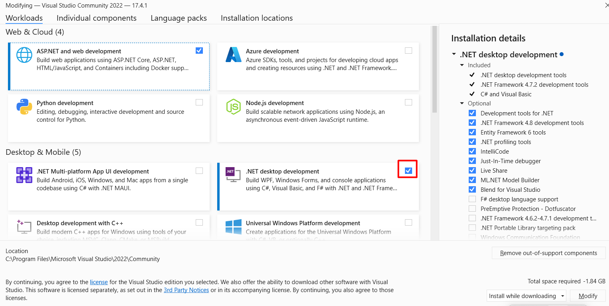
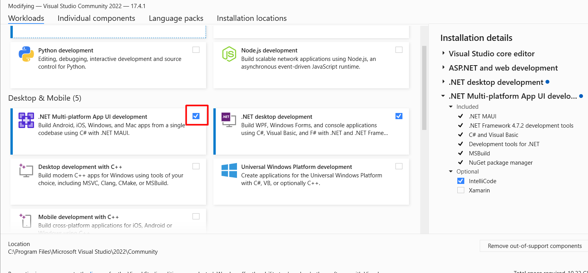

## How to install VS 2022 🎈
1. Download Visual Studio Community version from this link:

[Visual Studio Community](https://visualstudio.microsoft.com/vs/community/)

2. Check ASP.NET and web development box ( For later subjects )

4. Check the .NET desktop development box 

6. Check .NET multi platform development

7. Click install and wait for the program to install
8. When it is installed open it and log in with a microsoft account

## Extra materials
* [Rextester - An online tool for running C#](https://rextester.com/)
* [DOT.NET Fiddle - An online tool for running C#](https://dotnetfiddle.net/)